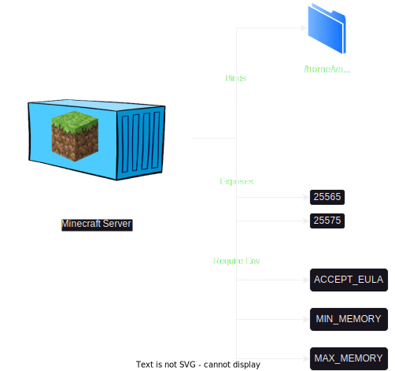
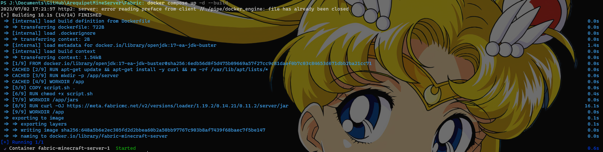
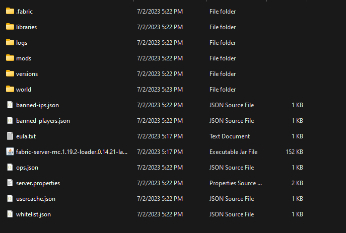
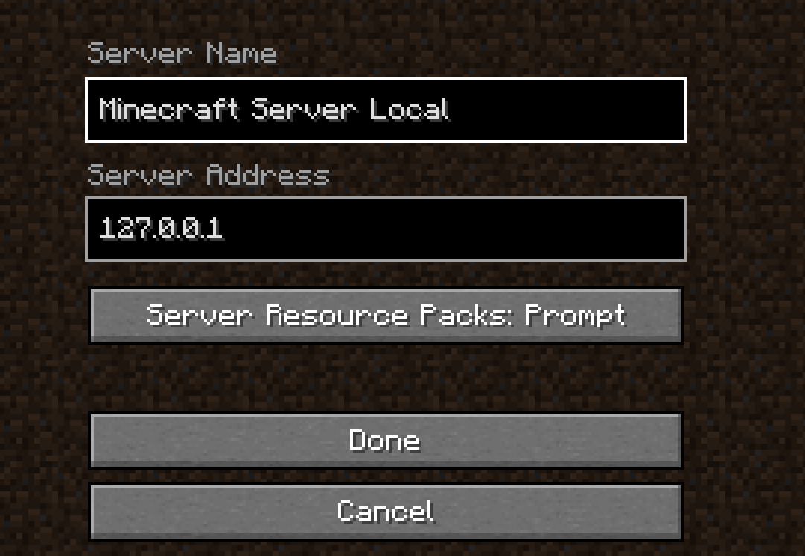
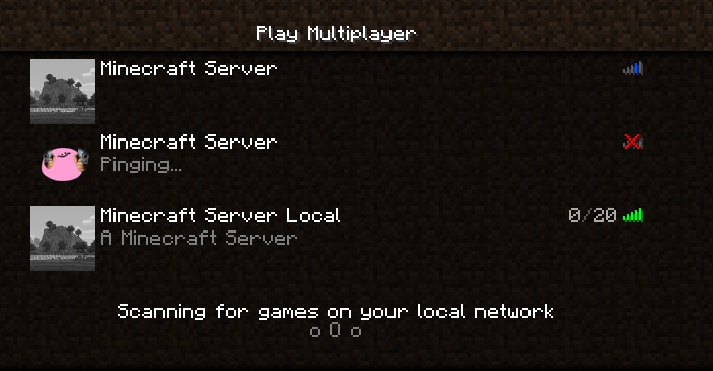
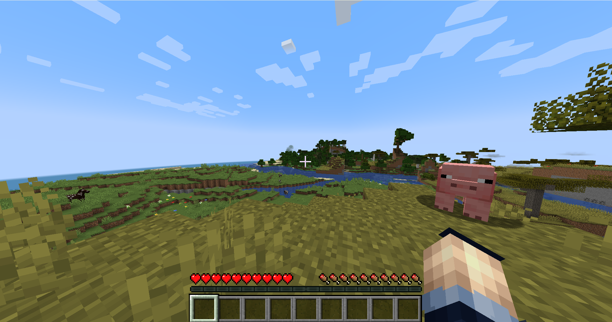

We enjoy playing Minecraft during our vacations. To facilitate this, we rent a cloud provider and utilize a virtual machine to host our vanilla Minecraft server or one with mods. However, we have consistently encountered an issue: the necessity of using Linux screen to run our Minecraft server in the background, and in the event of a server crash, we must manually restart it. Furthermore, if none of us with permissions to access the VM are available, restarting the server becomes impossible. Due to this predicament, we have made the decision to dockerize our Minecraft server in order to tackle this situation.

For that reason, we created [Arequipet](https://arequipet.vasitos.software/) to remotely run Minecraft commands and check the server's status. To make this possible, we utilized Docker for the frontend, backend, and Minecraft server. In this blog, we will discuss the process of dockerizing a Minecraft server.

<!--truncate-->

## Basic idea

We have in mind to create a Dockerfile that essentially binds a volume where the current Minecraft server is located. Additionally, we will create a Docker Compose file to enable health checks and ensure that the container can be restarted if any issues occur. We also plan to pass arguments such as Java arguments for resources, acceptance of EULA, and more.

### Diagram



## Fabric

We prefer to play Minecraft with mods in order to make the game more challenging and extensive, allowing us to enjoy it for a longer period of time. In this case we decided to use Fabric but this also can be made using Forge.

On this vacations we decided to play the most recent Minecraft versions `1.19.2` to explore the new mountains, caves, mobs, etc. For that reason we need the recent versions of Java Jdk starting from JDK 17. The docker file does not need to use Ubuntu, Debian, Fedora, or Alpine as base image because [OpenJdk](https://hub.docker.com/_/openjdk) provices its offical images for `Java Jdk 17`

:::tip

If your project uses a specific programming language, such as Java, it is advisable to search for its official Docker images on Docker Hub or another Docker repository. By doing so, you can avoid the need to download and install Java separately. The official Docker image already includes Java, and the provider ensures its installation and health.

:::

## Docker Image

First we need to define the base image in this case OpenJdk 17 with Debian

```dockerfile 
FROM openjdk:17-ea-jdk-buster
```

Install curl dependency 

```dockerfile 
RUN apt-get update && apt-get install -y curl && rm -rf /var/lib/apt/lists/*
RUN mkdir -p /app/server
```

### Set Workdir

First we need to define our base workdir where all application files, executables or scripts are found

```dockerfile
WORKDIR /app

# Copy the script
COPY script.sh .

# Set permissions for the script
RUN chmod +x script.sh
```

:::info

The line `COPY script.sh .` uses `.` because the `Dockerfile` and the `script.sh` are located in the same directory.

:::

#### Script 

On the next sections we are going to talk about the script to start MinecraftServer and get the server logs

### Download required files

It is important to donwload the Minecraft Fabric Server `.jar` file to execute the server and save on a different workdir that specifies where are located all our jars files

```dockerfile
WORKDIR /app/jars

# Download the FabricMC server jar using curl
RUN curl -OJ https://meta.fabricmc.net/v2/versions/loader/1.19.2/0.14.21/0.11.2/server/jar
```

### Prepare the application

The final step is to expose the required ports, and set the `ENTRYPOINT` where the script will be executed

```dockerfile
WORKDIR /app

# Game server
EXPOSE 25565
# Rcon port
EXPOSE 25575
# Set the script as the entrypoint
ENTRYPOINT ["./script.sh"]
```

That's all we finally created our Contenerized Minecraft Fabric Server.

## Script

The script is designed to accomplish two tasks: preparing the server and running an existing server. For that reason we need to check if:

1. Is there any `fabric-server-mc.1.19.2-loader.0.14.21-launcher.0.11.2.jar` file in the `/app/server` directory? If this is true, it indicates that a server may already be prepared.

2. Is the `eula.txt` file created? If this is true, it indicates that a server may already be prepared.

3. If the `eula.txt` file does not exist, verify if the environment variable `ACCEPT_EULA` is set to true. If this is true, create a file named `eula.txt` and add the line `eula=true`. However, if `ACCEPT_EULA` is set to `false`, the execution will be terminated, and the Minecraft server will not be started because the EULA is set to false.

4. Give permissions to execute the server

5. Run the `java` command to start the server, setting the minimum and maximum memory usage based on the `min_memory` and `max_memory` variables, which have default values or can use the environment variables `MIN_MEMORY` and `MAX_MEMORY`.

### Script.sh

```bash
#!/bin/bash

server_file="/app/server/fabric-server-mc.1.19.2-loader.0.14.21-launcher.0.11.2.jar"
eula_file="/app/server/eula.txt"
accept_eula="${ACCEPT_EULA:-false}"
min_memory="${MIN_MEMORY:-12288}"
max_memory="${MAX_MEMORY:-12288}"


if [ ! -f "$server_file" ]; then    
    if [ "$accept_eula" = "true" ]; then
        echo "Server file not found. Moving from /app/jars..."
        cp /app/jars/fabric-server-mc.1.19.2-loader.0.14.21-launcher.0.11.2.jar /app/server
        echo "File moved successfully."
        echo "eula=true" > "$eula_file"
        echo "eula.txt created with 'eula=true'."
    else
        echo "eula.txt not created as ACCEPT_EULA is not set to 'true'."
    fi
else
    echo "Server file already exists. No action needed."
fi

chmod +xrw "$server_file"
cd /app/server

java -Xms"$min_memory"M -Xmx"$max_memory"M --add-modules=jdk.incubator.vector -XX:+UseG1GC -XX:+ParallelRefProcEnabled -XX:MaxGCPauseMillis=200 -XX:+UnlockExperimentalVMOptions -XX:+DisableExplicitGC -XX:+AlwaysPreTouch -XX:G1HeapWastePercent=5 -XX:G1MixedGCCountTarget=4 -XX:InitiatingHeapOccupancyPercent=15 -XX:G1MixedGCLiveThresholdPercent=90 -XX:G1RSetUpdatingPauseTimePercent=5 -XX:SurvivorRatio=32 -XX:+PerfDisableSharedMem -XX:MaxTenuringThreshold=1 -Dusing.aikars.flags=https://mcflags.emc.gs -Daikars.new.flags=true -XX:G1NewSizePercent=40 -XX:G1MaxNewSizePercent=50 -XX:G1HeapRegionSize=16M -XX:G1ReservePercent=15 -jar "$server_file" --nogui
```

## Docker Compose

Finally, let's set up the Docker Compose file to start our Minecraft Server. We need to expose the required ports `25565` and `25575`, bind the volume where our Minecraft server is located or will be located, and set the necessary environment variables.

```yaml
version: '3'
services:
  minecraft-server:
    build:
      context: .
      dockerfile: Dockerfile
    ports:
      - "25565:25565"
      - "25575:25575"
    volumes:
      - "./server:/app/server"
    environment:
      ACCEPT_EULA : true
      MIN_MEMORY : 12288
      MAX_MEMORY : 14000
    restart: always
```

In this case, we use bind volumes, which enable us to use relative paths. This is possible because the server will be located in the same path as the `docker-compose.yml` file.

And the most important command is `restart: always`. This helps us automatically start the container if something happens, such as memory resource exhaustion, server crashes, or VM restarts.

## Run the server

To run the server, open your terminal, find your `docker-compose.yml` and execute the command `docker compose up -d --build`. Wait until your server is ready, which is indicated by the logs displaying that the world has been successfully generated.



Once your container is running you will see these files on your host machine



Running this command `docker logs -f minecraft-server` you will see the server logs


If everything is okay, you can join the Minecraft server and start playing.

First add the minecraft server








Congratulations! You have successfully set up a Minecraft server using Docker and Docker Compose.

