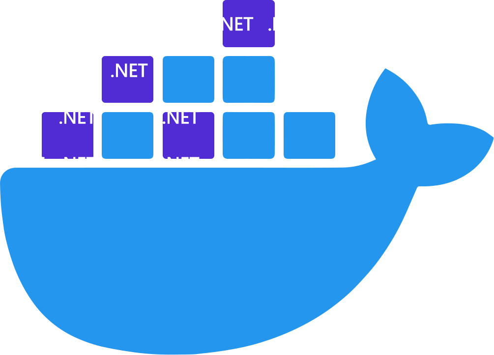

In this tutorial, we'll walk through the process of containerizing an ASP.NET Core application using Docker.

<!--truncate-->

## Prerequisites

Before getting started, ensure that you have the following prerequisites installed:

- [.NET SDK](https://dotnet.microsoft.com/download) - Make sure you have .NET Core SDK installed on your machine.
- [Docker](https://www.docker.com/get-started) - Install Docker Desktop to build and run Docker containers.

:::note
For this example we are going to use .Net 6.0
:::

## Create an ASP.NET Core Web API

First, let's create a simple ASP.NET Core Web API project:

```bash
dotnet new webapi -n WebApiBlogExample
cd WebApiBlogExample
```

:::info
[Download Source Code](https://github.com/egonzalezt/Containers/tree/main/blog/2023-07-03-aspnetcore/api)
:::

## Dockerfile

Next, we need to create a `Dockerfile` in the root directory of our project. This file defines the instructions to build a Docker image for our ASP.NET Core application.

```dockerfile
FROM mcr.microsoft.com/dotnet/aspnet:6.0 AS base
WORKDIR /app
EXPOSE 80

FROM mcr.microsoft.com/dotnet/sdk:6.0 AS build
WORKDIR /src
COPY ["WebApiBlogExample.csproj", "."]
RUN dotnet restore "./WebApiBlogExample.csproj"
COPY . .
WORKDIR "/src/."
RUN dotnet build "WebApiBlogExample.csproj" -c Release -o /app/build

FROM build AS publish
RUN dotnet publish "WebApiBlogExample.csproj" -c Release -o /app/publish

FROM base AS final
WORKDIR /app
COPY --from=publish /app/publish .
ENTRYPOINT ["dotnet", "WebApiBlogExample.dll"]
```

This Dockerfile follows best practices like using multi-stage builds, leveraging the appropriate base images, and minimizing image layers.

## Build the Docker Image

To build the Docker image, run the following command in the terminal:

```bash
docker build -t example-api .
```

## Run the Docker Container

Once the image is built, we can run a container from it using the following command:

```bash
docker run -d -p 5000:80 --name aspnet-test example-api
```

This command runs docker on detached mode, and maps the port `80` to the port `5000` on the host machine, you can set another port depending on your requirements

## Access the API

On your browser visit `http://localhost:5000/swagger/index.html` to use swagger or using go to `http://localhost:5000/WeatherForecast` in your web browser or using tools like Postman. This URL corresponds to the route defined in the default WeatherForecastController included in the ASP.NET Core Web API template.

## Additional Tips and Best Practices

Here are some additional tips and best practices to consider when creating Dockerfiles for ASP.NET Core applications:

### Use a specific SDK version

Specify a specific version of the .NET SDK in the FROM statement to ensure consistency across different build environments.

```dockerfile
FROM mcr.microsoft.com/dotnet/sdk:6.0 AS build
```

### Leverage build-time arguments

Use build-time arguments to pass values to the Docker build process, such as version numbers or API keys. This allows flexibility without exposing sensitive information in the final image.

```dockerfile
ARG VERSION=1.0
ENV APP_VERSION=$VERSION
```

### Separate NuGet package restore from source code copy

Split the steps of restoring NuGet packages and copying the source code into separate `COPY` statements. This takes advantage of Docker's layer caching mechanism, reducing the number of package restores during subsequent builds.

```dockerfile
# Copy csproj and restore dependencies
COPY *.csproj .
RUN dotnet restore

# Copy the remaining files and build the application
COPY . .
RUN dotnet publish -c Release -o out
```

### Use a separate build stage for tests

If you have unit tests or integration tests, consider adding a separate build stage dedicated to running the tests. This allows for faster iterative development by skipping test execution during normal builds.

```dockerfile
# Stage 1: Build the application
FROM mcr.microsoft.com/dotnet/sdk:6.0 AS build
# ...

# Stage 2: Run tests
FROM build AS test
# ...

# Stage 3: Create the runtime image
FROM mcr.microsoft.com/dotnet/aspnet:6.0 AS runtime
# ...
```

### Limit the scope of `COPY` statements

Only copy the necessary files into the image. Use a .dockerignore file to exclude files and directories that are not required for runtime, such as build artifacts, source code, and test files.

### Minimize layers by combining commands

Reduce the number of layers in the Docker image by combining related commands using `RUN` statements. This helps reduce image size and build time.

```dockerfile
RUN dotnet restore \
    && dotnet publish -c Release -o out
```

### Clean up intermediate build artifacts

Remove unnecessary files and build artifacts within the Dockerfile to reduce the size of the final image. Use `RUN` statements to delete files or directories that are no longer needed after the build process.

For example if you are downloading packages from linux like `curl` or `wget` you need to run `apt-get update` then `apt-get install curl` linux creates a directory `/var/lib/apt/lists/` that contains lists of APT to determine which packages are available, their versions, and other metadata, which are essentially text files with information about available packages from various software repositories.

That information is no longer needed, for that reason is a good idea delete these lists running `rm -rf /var/lib/apt/lists/*`

### Utilize multi-stage builds for different environments

Consider using multi-stage builds to separate the build environment from the runtime environment. This allows you to keep the final image lightweight by including only the necessary runtime dependencies. For example:

```dockerfile
# Stage 1: Build the application
FROM mcr.microsoft.com/dotnet/sdk:6.0 AS build
# ...

# Stage 2: Create the runtime image
FROM mcr.microsoft.com/dotnet/aspnet:6.0 AS runtime
# ...
```

### Secure sensitive information

Avoid hardcoding sensitive information like API keys or database connection strings in the Dockerfile. Instead, use environment variables or secrets management solutions to inject them into the container at runtime.

### Implement health checks

Add health checks to your Dockerfile using the `HEALTHCHECK` instruction. This helps ensure that the container is in a healthy state and improves monitoring capabilities.

```dockerfile
# Stage 1: Build the application
FROM mcr.microsoft.com/dotnet/sdk:6.0 AS build
# ...

# Stage 2: Create the runtime image
FROM mcr.microsoft.com/dotnet/aspnet:6.0 AS runtime
# ...

# Add health check
HEALTHCHECK --interval=30s --timeout=3s \
    CMD curl -f http://localhost/health || exit 1

ENTRYPOINT ["dotnet", "MyApi.dll"]
```

### Update base images and dependencies
Periodically update the base images and dependencies used in your Dockerfile to incorporate security patches, bug fixes, and performance improvements. This helps keep your application secure and up to date.

:::tip
Visit the official .NET docker images, some of these images are build for specific use cases.

* [.NET SDK](https://hub.docker.com/_/microsoft-dotnet-sdk/)
* [ASP.NET Core Runtime](https://hub.docker.com/_/microsoft-dotnet-aspnet/)
* [.NET Runtime](https://hub.docker.com/_/microsoft-dotnet-runtime/)
* [.NET Runtime Dependencies](https://hub.docker.com/_/microsoft-dotnet-runtime-deps/)
* [.NET Monitor Tool](https://hub.docker.com/_/microsoft-dotnet-monitor/)
* [.NET Samples](https://hub.docker.com/_/microsoft-dotnet-samples/)
:::

:::note
Visit Microsoft Official docs about [.NET Docker](https://learn.microsoft.com/en-us/dotnet/core/docker)