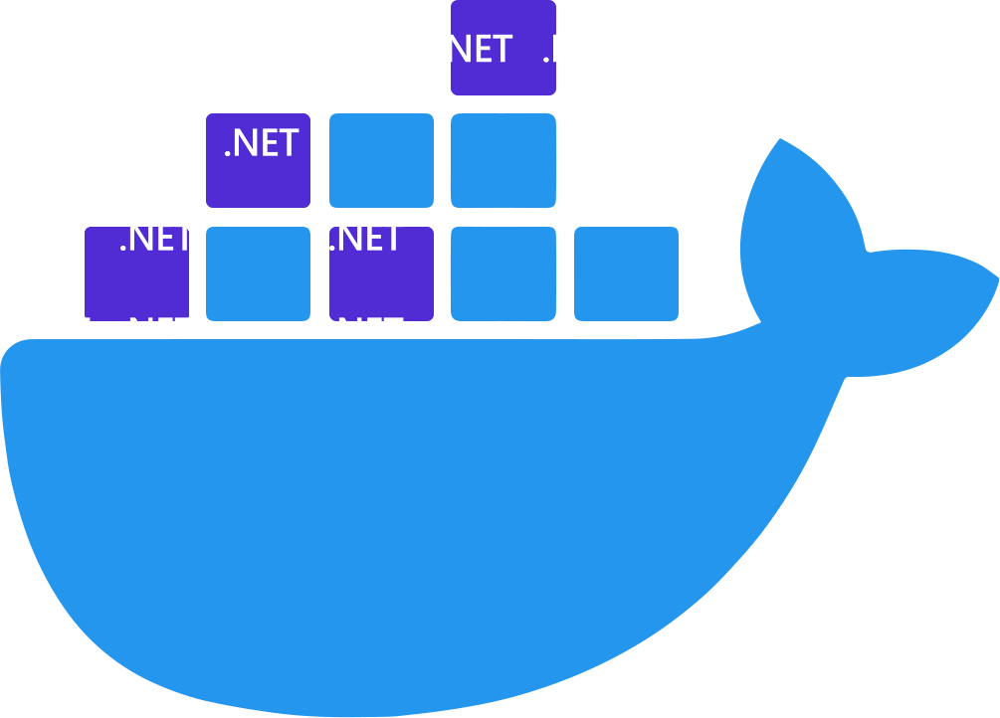

Today we will guide you through the process of containerizing a .NET Core application step by step. We will cover the basic concepts, tools, and best practices for containerization. Let's get started!

<!--truncate-->

## Prerequisites

- [.NET SDK](https://dotnet.microsoft.com/download) - Make sure you have .NET Core SDK installed on your machine.
- [Docker](https://www.docker.com/get-started) - Install Docker Desktop to build and run Docker containers.

## Create a .NET Core Application

Open your terminal or command prompt and run the following commands:

```bash
dotnet new console -n ConsoleApp
cd ConsoleApp
```

## Build and Test the Application

```bash
dotnet build
dotnet run
```

## Dockerfile

Create a new file named `Dockerfile` in the root directory of your application. Open it in a text editor and add the following content:

```bash
FROM mcr.microsoft.com/dotnet/sdk:7.0 AS build-env
WORKDIR /App

# Copy the project file and restore dependencies
COPY *.csproj .
RUN dotnet restore

# Copy the remaining source code and build the application
COPY . .
RUN dotnet publish -c Release -o out

# Build runtime image
FROM mcr.microsoft.com/dotnet/aspnet:7.0 AS runtime
WORKDIR /App
COPY --from=build-env /App/out .
ENTRYPOINT ["dotnet", "ConsoleApp.dll"]
```

This Dockerfile defines a multi-stage build. It uses the .NET Core SDK image to build the application and then copies the built artifacts to a separate .NET Core Runtime image for a smaller and more efficient runtime environment.

## Build the Docker Image

```bash
docker build -t myapp .
```

## Run the Container

```bash
docker run myapp
```

## Good Practices

Please visit this post where we discuss Docker best practices for containerized .NET applications. We talk about valuable tips for a smooth containerization process. [Let's dive in!](/Containers/blog/aspnet%20docker#additional-tips-and-best-practices)

## Conclusion

Today, we walked through the process of containerizing a .NET Core application. We covered the basic steps from creating a Dockerfile to running the application as a container. Additionally, we discussed some best practices and tips to follow when working with Docker and .NET Core.

Happy Dockerizing!

:::note
* Visit Microsoft Official docs about [.NET Docker](https://learn.microsoft.com/en-us/dotnet/core/docker)

* Visit Docker Tutorial [Build your .NET image](https://docs.docker.com/language/dotnet/build-images/)
:::

