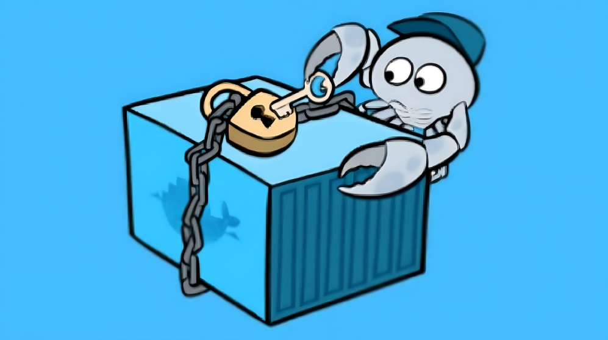

Reference: http://enterprisetimes.co.uk/wp-content/uploads/2015/08/Notary.jpg


Dockerfiles are essential for building Docker images, but they can also introduce security vulnerabilities if not properly managed. In this post, we'll discuss some good and bad practices for Dockerfile security.

<!--truncate-->

## Good Practices

### Regular Image Updates and Versioning Strategy

Use base images that are frequently updated, and rebuild yours on top of them.

Follow this versioning strategy to keep your images up-to date


* Stick to stable or long-term support versions, which deliver security fixes soon and often Plan in advance. 
* Be ready to drop old versions and migrate before your base image version reaches the end of its life and stops receiving updates.
* Rebuild your own images periodically and with a similar strategy to get the latest packages from the base distro, .NET, Node, Golang, Python, etc. Most package or dependency managers, like npm or go mod, will offer ways to specify version ranges to keep up with latest security updates.

### Use a Minimal Base Image

```dockerfile
FROM alpine:3.14
```

Using a minimal base image **reduces the attack surface and potential vulnerabilities.** By starting with a lightweight base image, you only include the necessary components, reducing the risk of exposing unnecessary services or libraries.

### Update and Upgrade Packages

```dockerfile
RUN apk update && apk upgrade
```

Keeping packages up to date helps ensure the latest security patches are applied. Regularly updating and upgrading packages within the Docker image helps protect against known vulnerabilities.

### Create a Non-Root User

```dockerfile
# Create user and set ownership and permissions as required
RUN adduser -D myuser && chown -R myuser /myapp-data
# ... copy application files
USER myuser
ENTRYPOINT ["/myapp"]
```

Running containers as a non-root user reduces the impact of potential vulnerabilities. If an attacker gains access to a container running as root, it increases the risk of privilege escalation attacks. By creating and running the container as a non-root user, you limit the attacker's capabilities.

### Copy Only Necessary Files

```dockerfile
COPY app /app
```

Only copy the required files into the container to reduce the risk of including unnecessary or sensitive information. Including only the necessary files limits the potential attack surface and reduces the chances of exposing sensitive data.

### Secure Container Environments: Enforcing Immutable Executables Ownership

To ensure utmost security in containerized environments, it is crucial to enforce strict control over executable files. This Dockerfile best practice highlights the importance of assigning root ownership to all executables within a container, regardless of whether they are executed by non-root users or require limited write access.

By implementing this best practice, potential threats are mitigated by blocking unauthorized modification of essential binaries and scripts. Such unauthorized modifications could potentially exploit vulnerabilities and lead to various forms of attacks. Upholding container immutability through this approach ensures that running applications remain safeguarded against accidental or malicious alterations.

```dockerfile
WORKDIR $APP_HOME
COPY --chown=app:app app-files/ /app
USER app
ENTRYPOINT /app/my-app-entrypoint.sh
```

:::danger
The app user only needs execution permissions on the file, **not ownership.**
:::

### Use Specific Versions for Package Installations

```bash
RUN pip install --no-cache-dir requests==2.25.1
```

Specifying exact versions of packages helps maintain consistent and known dependencies. It ensures that the container uses specific versions of packages that have been tested and verified, reducing the risk of compatibility issues or unexpected vulnerabilities.

### Dockerignore

A typical procedure for building with docker, using a default Dockerfile and the current folder as the context:

To execute the build, use the following command:

```dockerfile
docker build -t myimage .
```

However, please exercise caution!

The `.` parameter represents the build context. Utilizing `.` as the context can be risky as it may lead to copying sensitive or unnecessary files into the container. These files could include configuration files, credentials, backups, lock files, temporary files, source code, subfolders, dotfiles, and so on.

Consider a scenario where the Dockerfile contains the following command:

```dockerfile
COPY . /my-app
```

This command will copy everything from the build context, which, in the case of using `.`, encompasses the Dockerfile itself.

Following Dockerfile best practices, it is advisable to create a subfolder that contains only the necessary files to be copied into the container. Set this subfolder as the build context and, whenever possible, explicitly specify the files to be copied using the COPY instructions (avoid using wildcards). For instance:

```bash
docker build -t myimage files/
```

Additionally, it is recommended to create a `.dockerignore` file to explicitly exclude certain files and directories.

Even if you exercise utmost care with the `COPY` instructions, the entire build context is transmitted to the docker daemon before the image build commences. Consequently, having a smaller and more restricted build context will result in faster builds.

Organize your build context within its own folder and use .dockerignore to minimize its contents as much as possible.

### ADD and COPY

The `ADD` and COPY instructions in a Dockerfile serve similar purposes. However, `COPY` is considered more explicit.

It is recommended to use `COPY` unless you specifically require the functionality provided by `ADD`, such as adding files from a URL or a tar file. `COPY` offers greater predictability and reduces the likelihood of errors.

In certain cases, it is preferable to use the `RUN` instruction instead of `ADD` to download a package using tools like curl or wget, extract its contents, and then remove the original file in a single step. This approach helps minimize the number of layers in the image.

### Docker port socket and TCP protection

The docker socket provides privileged access to the host system and can be exploited for unauthorized access and malicious activities. It is crucial to ensure that the `/var/run/docker.sock` file has the appropriate permissions. If you choose to expose Docker via TCP (although it is strongly discouraged), it is essential to implement proper security measures to safeguard against potential threats.

:::danger
Please refrain from granting permissions to everyone for the Docker socket or Docker TCP port. Instead, kindly follow the official Docker guide on how to protect the Docker daemon socket: [Protect the Docker daemon socket](https://docs.docker.com/engine/security/protect-access/)
:::
## Bad Practices

### Running as Root User

Running containers as the root user increases the risk of privilege escalation attacks. If an attacker gains control of the container, **running as root grants them full access to the system.** It is recommended to run containers as non-root users to limit the potential impact of such attacks.

### Installing Unnecessary Packages

Including unnecessary packages can introduce additional vulnerabilities and bloat the container. Each installed package increases the attack surface, as it potentially includes libraries and binaries that may have their own vulnerabilities.

###  Using Default Credentials

```dockerfile
ENV MYSQL_ROOT_PASSWORD=root
```

Using default or weak credentials can lead to unauthorized access or compromise of the container. It is crucial to set strong, unique passwords and avoid using default credentials for services within the container.

### Exposing Unnecessary Ports

```dockerfile
EXPOSE 8080
```

Exposing unnecessary ports can increase the attack surface of the container. Only expose the required ports for the application to limit potential access points for attackers.

### Running Multiple Services in a Single Container

```dockerfile
CMD ["nginx", "-g", "daemon off;", "python app.py"]
```

Running multiple services increases the complexity and potential vulnerabilities within the container. It is recommended to separate services into individual containers, as it allows better isolation and reduces the risk of one compromised service affecting others.

## Conclusion

Following these best practices for Dockerfile security helps minimize the risk of vulnerabilities and enhances the overall security of your containerized applications. By starting with a minimal base image, keeping packages up to date, running as non-root users, copying only necessary files, and using specific versions of packages, you can create more secure Docker images.

Stay secure and Happy Dockerizing!

### References

* [Top 20 Dockerfile best practices](https://sysdig.com/blog/dockerfile-best-practices/)
* [Security best practices](https://docs.docker.com/develop/security-best-practices/)
* [Docker security](https://docs.docker.com/engine/security/)
* [10 Docker Security Best Practices](https://snyk.io/blog/10-docker-image-security-best-practices/)