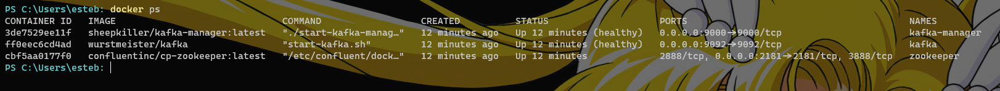

# Compose Kafka Example

In the previous chapters, we talked about Docker commands and ran Kafka + ZooKeeper + Kafka-Manager. This time, we will do the same with Docker Compose.

```yml
version: '3'
services:
  zookeeper:
    image: confluentinc/cp-zookeeper:latest
    container_name: zookeeper
    ports:
      - "2181:2181"
    environment:
      - ZOOKEEPER_CLIENT_PORT=2181
    networks:
      - kafka-network

  kafka:
    image: wurstmeister/kafka
    container_name: kafka
    ports:
      - "9092:9092"
    environment:
      - KAFKA_ZOOKEEPER_CONNECT=zookeeper:2181
      - KAFKA_ADVERTISED_LISTENERS=PLAINTEXT://kafka:9092
      - KAFKA_LISTENERS=PLAINTEXT://0.0.0.0:9092
      - KAFKA_CREATE_TOPICS=test_topic:1:1
    depends_on:
      - zookeeper
    volumes:
      - kafka-data:/kafka/data
    networks:
      - kafka-network
    healthcheck:
      test:
        [
          "CMD",
          "kafka-topics.sh",
          "--list",
          "--bootstrap-server",
          "kafka:9092"
        ]
      interval: 10s
      timeout: 10s
      retries: 3

  kafka-manager:
    image: sheepkiller/kafka-manager:latest
    container_name: kafka-manager
    ports:
      - "9000:9000"
    environment:
      - ZK_HOSTS=zookeeper:2181
    depends_on:
      - zookeeper
      - kafka
    networks:
      - kafka-network
    healthcheck:
      test: [ "CMD", "curl", "-f", "http://localhost:9000" ]
      interval: 10s
      timeout: 10s
      retries: 3

networks:
  kafka-network:

volumes:
  kafka-data:
```

[Download The file](./ComposeFiles/docker-compose.yml)

## Explanation

### ZooKeeper Service

The zookeeper service is based on the `confluentinc/cp-zookeeper:latest` Docker image. It serves as the centralized coordination service for Apache Kafka. The service is named "zookeeper" and exposes port 2181 to allow external access. The `ZOOKEEPER_CLIENT_PORT` environment variable is set to 2181 to configure the ZooKeeper client port. The service is connected to the "kafka-network" network.

### Kafka Service

The kafka service is based on the `wurstmeister/kafka` Docker image. It represents the Kafka broker. The service is named "kafka" and exposes port 9092 to allow external access. Several environment variables are defined to configure Kafka:

- `KAFKA_ZOOKEEPER_CONNECT`: Specifies the connection string for ZooKeeper, using the "zookeeper:2181" address.
- `KAFKA_ADVERTISED_LISTENERS`: Defines the listeners that Kafka advertises to clients. In this case, it uses "PLAINTEXT://kafka:9092".
- `KAFKA_LISTENERS`: Specifies the listeners that Kafka listens on. It uses "PLAINTEXT://0.0.0.0:9092" to listen on all network interfaces.
- `KAFKA_CREATE_TOPICS`: Creates a topic named "test_topic" with one partition and one replica.

The kafka service depends on the zookeeper service and mounts a volume named "kafka-data" to persist Kafka data. It is connected to the "kafka-network" network. Additionally, a healthcheck is defined to verify the health of the Kafka service. It runs the `kafka-topics.sh --list --bootstrap-server kafka:9092` command to check if Kafka is functioning properly.

### Kafka Manager Service

The service is named "kafka-manager" and exposes port 9000 to allow external access. The `ZK_HOSTS` environment variable is set to "zookeeper:2181" to specify the ZooKeeper connection. The kafka-manager service depends on both the zookeeper and kafka services and is connected to the "kafka-network" network. A healthcheck is defined to check if the Kafka Manager web interface is accessible using the `curl -f http://localhost:9000` command.

### Networks and Volumes

The configuration defines a network named "kafka-network" that connects all the services together. 

Creates a volume named "kafka-data" that is used by the kafka service to store persistent data.

## Run docker-compose.yml

Run on your terminal `docker compose up` or `docker compose up -d`. Open on your browser `http://localhost:9000` and follow the steps from [Docker Network Commands Example](/Containers/docs/Network/commands#setup-kafka)


:::info
Thanks to Docker Compose, it is not necessary to first run `ZooKeeper`. Once it is ready, you can run `Kafka` and wait until it is ready before running `Kafka-Manager`. In Compose, you can specify all the steps to follow for starting your containers.
:::
