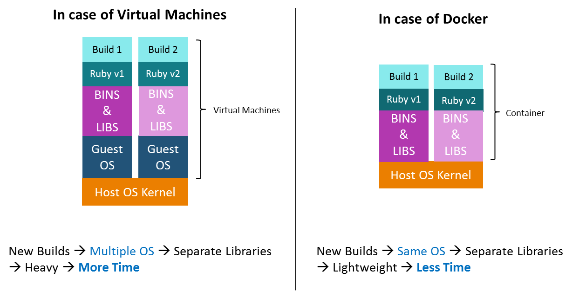

# Intro

Now lets talk about Docker, Docker is a software development tool that uses containers. Containers are like lightweight, self-contained packages of software that can be easily run on different platforms. Unlike virtual machines, which mimic entire hardware servers, containers only need the operating system to function.

Imagine you have a piece of software that you want to run. With Docker, you can package that software along with all its dependencies into a container. This container includes everything needed to run the software, such as libraries, files, and settings. It's like a mini-environment that can be easily transported and executed on various machines.

Containers are platform-independent, which means you can run them on Windows or Linux-based systems. Docker can even be used within a virtual machine if necessary. The main goal of Docker is to enable the deployment of microservice applications in a distributed architecture.

Compared to virtual machines, Docker operates at a higher level of abstraction. Instead of emulating an entire server, Docker focuses on abstracting the operating system's kernel. This approach brings several benefits, including application portability, separation of infrastructure, and the ability to create self-contained microservices.

:::note

While a container is a concept and technology that enables lightweight and portable software packaging, Docker is a specific platform and toolset that makes it easier to work with containers.

:::

