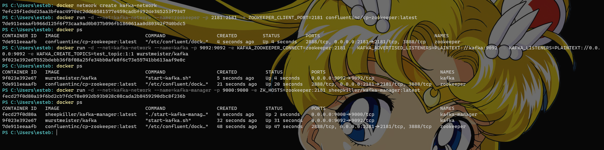
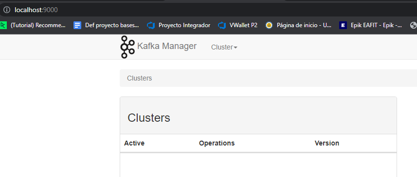
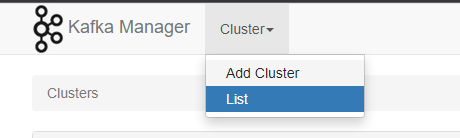
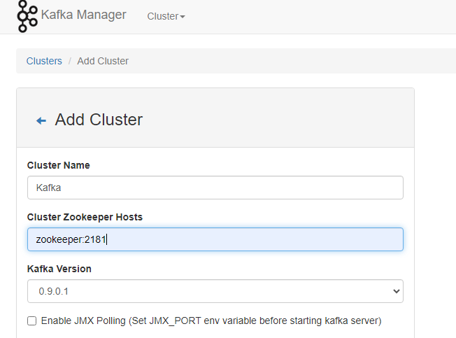
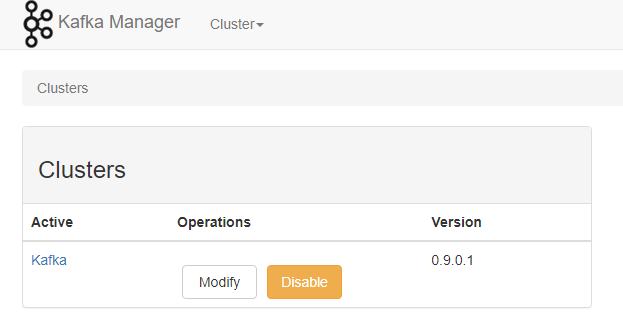
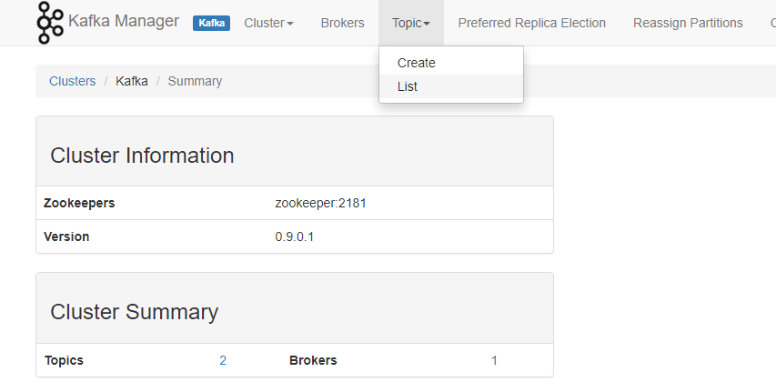
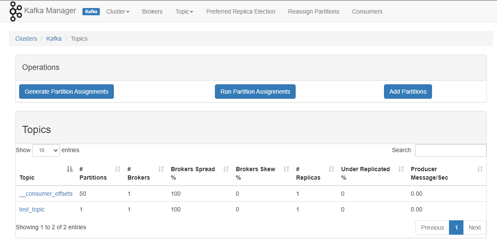
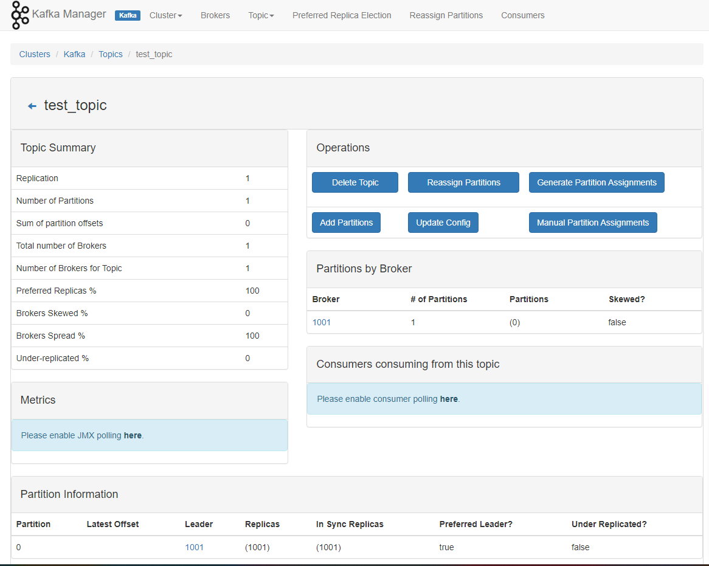

# Docker Network Commands

Docker provides a set of network commands that allow you to manage and configure networking for your Docker containers. These commands enable you to create, connect, disconnect, inspect, and remove networks, providing flexibility and control over container communication and connectivity.

## List Networks: `docker network ls`

The `docker network ls` command lists all the networks created on the Docker host. You can use the `-f` or `--filter` flag to filter networks based on conditions. For example, to list only bridge networks, you can run `docker network ls --filter "driver=bridge"`.

## Create a Network: `docker network create`

The `docker network create` command is used to create a new user-defined network. You can specify the network driver using the `--driver` flag, such as `--driver bridge` for a bridge network. Additionally, you can set the subnet for the network using the `--subnet` flag, e.g., `--subnet 172.18.0.0/16`. This command allows you to define custom networks to isolate your containers.

## Connect a Container to a Network: `docker network connect`

The `docker network connect` command is used to connect a container to a network. You can specify an alias for the container using the `--alias` flag. For example, `docker network connect --alias db my-network my-container` connects `my-container` to `my-network` with the alias "db". This allows containers to communicate with each other within the network.

## Disconnect a Container from a Network: `docker network disconnect`

The `docker network disconnect` command is used to disconnect a container from a network. By default, the command requires the container to be stopped. However, you can force disconnection using the `--force` flag even if the container is still running. For example, `docker network disconnect --force my-network my-container` forcefully disconnects `my-container` from `my-network`.

## Inspect a Network: `docker network inspect`

The `docker network inspect` command provides detailed information about a network. You need to specify the name or ID of the network to inspect. For example, `docker network inspect my-network` displays information about the `my-network` network, including its IP range, connected containers, and other network settings.

## Remove a Network: `docker network rm`

The `docker network rm` command is used to remove one or more networks. You need to specify the name or ID of the network to be removed. By default, the command fails if containers are still connected to the network. However, you can use the `-f` or `--force` flag to force removal, even if containers are still connected.

## Prune Unused Networks: `docker network prune`

The `docker network prune` command removes all unused networks from the Docker host. Unused networks are those not connected to any containers. You can use the `-f` or `--force` flag to force the removal of unused networks.

These Docker network commands provide the necessary tools to manage networking for your containers effectively, allowing you to create, connect, disconnect, inspect, and remove networks as per your requirements.


## Example

In this example, we are going to set up a message broker, specifically Apache Kafka. Kafka requires ZooKeeper to be able to run. Additionally, we will include Kafka-Manager to visualize all our topics and verify if these applications can communicate with each other using the Docker network.

### Create the network

Step 1: Create a Docker network

```bash
docker network create kafka-network
```

### Add ZooKeeper

Step 2: Run ZooKeeper container on the network

```bash
docker run -d --net=kafka-network --name=zookeeper -p 2181:2181 -e ZOOKEEPER_CLIENT_PORT=2181 confluentinc/cp-zookeeper:latest
```

### Add Kafka

Step 3: Run Kafka container on the network

```bash
docker run -d --net=kafka-network --name=kafka -p 9092:9092 -e KAFKA_ZOOKEEPER_CONNECT=zookeeper:2181 -e KAFKA_ADVERTISED_LISTENERS=PLAINTEXT://kafka:9092 -e KAFKA_LISTENERS=PLAINTEXT://0.0.0.0:9092 -e KAFKA_CREATE_TOPICS=test_topic:1:1 wurstmeister/kafka
```

:::caution

If you set KAFKA_ZOOKEEPER_CONNECT to `localhost` instead of `zookeeper` in the Kafka container, it will attempt to connect to a ZooKeeper instance running on the same container as Kafka.

However, this configuration will not work as expected because the ZooKeeper container is not running on the `localhost` interface within the Kafka container. Each container has its own network stack and resolves the hostname `localhost` to its own loopback interface.

To establish the correct connection between Kafka and ZooKeeper containers, you should use the container name (`zookeeper`) 
:::

### Run Kafka-Manager

Run the Kafka-Manager container and connect it to the existing `kafka-network`

```bash
docker run -d --net=kafka-network --name=kafka-manager -p 9000:9000 -e ZK_HOSTS=zookeeper:2181 sheepkiller/kafka-manager:latest
```

### Connection

On this example docker uses it's internal Dns to resolve the hostname of `kafka` or `zookeeper` to make it possible to each container communicate, in this example is crucial because kafka needs zookeeper and Kafka-Manager needs Kafka, in other words Docker know how to translate `kafka` into `172.169.0.1`

### Results

Run the commands



if running `docker ps` you'll able to see all the containers go to your browser and search `localhost:9000` to access into Kafka-Manager

#### Setup Kafka



Then add a cluster



Setup your cluster and save the configuration



Now you are able to see your new cluster



Access into your cluster and go to topics



If you see a topic called `test_topic` you have successfully connected Kafka, ZooKeeper, and Kafka Manager, which means that your network is functioning successfully.





:::info

The example topic is created thanks to this command in your Kafka Docker run: `KAFKA_CREATE_TOPICS=test_topic:1:1`

:::

### Inspecting the network

```bash {6,37,40,44,47,51,54} showLineNumbers
PS C:\Users\esteb: docker network ls

NETWORK ID     NAME            DRIVER    SCOPE
17d5b6f369e0   bridge          bridge    local
448c5c6e49ea   host            host      local
7efc25f1ed4d   kafka-network   bridge    local
4e742a4be607   none            null      local

PS C:\Users\esteb: docker network inspect kafka-network
[
    {
        "Name": "kafka-network",
        "Id": "7efc25f1ed4d25aa3bfeac4970ec2dd60581577e459cadbf9924e345253f7347",
        "Created": "2023-07-02T17:48:16.068177174Z",
        "Scope": "local",
        "Driver": "bridge",
        "EnableIPv6": false,
        "IPAM": {
            "Driver": "default",
            "Options": {},
            "Config": [
                {
                    "Subnet": "172.20.0.0/16",
                    "Gateway": "172.20.0.1"
                }
            ]
        },
        "Internal": false,
        "Attachable": false,
        "Ingress": false,
        "ConfigFrom": {
            "Network": ""
        },
        "ConfigOnly": false,
        "Containers": {
            "7fe28846044ef41de6d27fb77bbe38f9ee7b6ca4c851ee210d322b3052528294": {
                "Name": "zookeeper",
                "EndpointID": "9c5ae424cb4f2ba8bf76b4d2059c85395c5510abe56112ee16862a21bf129e0f",
                "MacAddress": "02:42:ac:14:00:02",
                "IPv4Address": "172.20.0.2/16",
                "IPv6Address": ""
            },
            "c19fa42ccc2334415214f6abf2ea881e6f233ab0771f4fa0f80845c0c7d8d9d5": {
                "Name": "kafka-manager",
                "EndpointID": "a6e53345c9f81351289a6776b15bd9571ece305d09551a991fa428fae846bfd6",
                "MacAddress": "02:42:ac:14:00:04",
                "IPv4Address": "172.20.0.4/16",
                "IPv6Address": ""
            },
            "f0241cd216bc9d0448c809142269eb84170df39e1f26a250f9bafd164ec0ca64": {
                "Name": "kafka",
                "EndpointID": "d4c49426830f20406badfd8db56817a7ff442ff701baa274a3cdf4dd9a6b943c",
                "MacAddress": "02:42:ac:14:00:03",
                "IPv4Address": "172.20.0.3/16",
                "IPv6Address": ""
            }
        },
        "Options": {},
        "Labels": {}
    }
]
```

On this example you can see that `Kafka` belongs into `kafka-network` and it's **hostname** will be translated into `172.20.0.3/16`